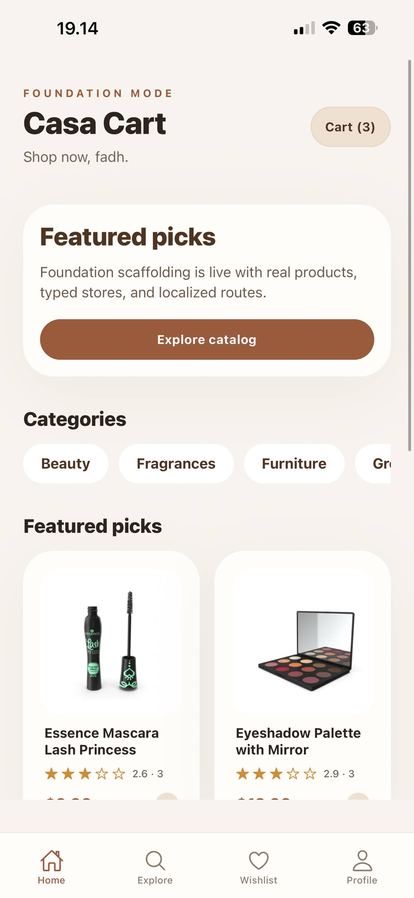
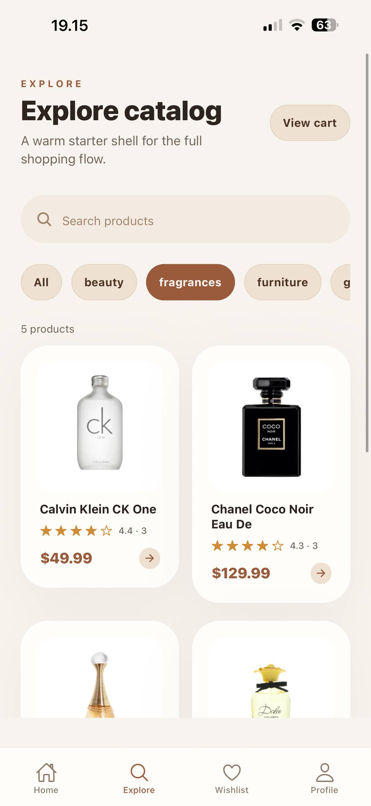
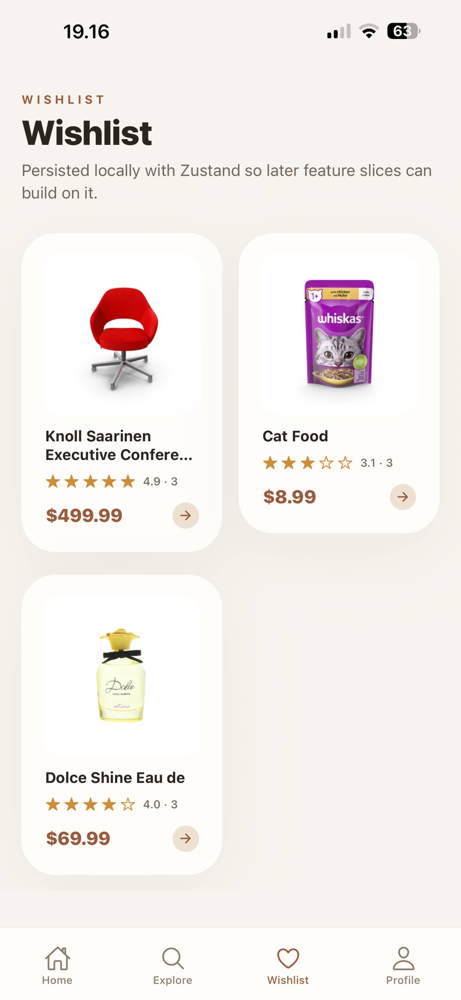
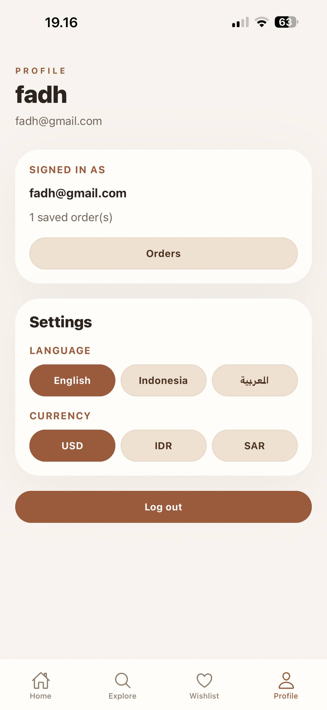

# E-Commerce Foundation 🛍️

A modern, cross-platform mobile e-commerce application built with **React Native**, **Expo**, and **TypeScript**. This project demonstrates a production-ready foundation for an online shopping app, featuring a clean warm-toned UI, full authentication flow, product browsing, cart management, checkout, and multi-language support.

## ✨ Key Features

- **Authentication**: Complete login & registration flow with form validation using React Hook Form and Zod schema validation.
- **Product Catalog**: Browse and search products with category filtering, powered by the FakeStore API.
- **Product Detail**: View detailed product information including images, descriptions, ratings, and pricing.
- **Shopping Cart**: Add, update quantity, and remove items with a persistent cart powered by Zustand and AsyncStorage.
- **Wishlist**: Save favorite products for later with a dedicated wishlist tab.
- **Checkout & Payment**: Multi-step checkout flow with shipping information, payment method selection, and order confirmation.
- **Order History**: Track past orders with detailed order views and status tracking.
- **Multi-Language (i18n)**: Supports **English**, **Indonesian**, and **Arabic** (with RTL layout support) via i18next.
- **Skeleton Loading**: Smooth loading states with skeleton placeholders for a polished UX.
- **Tab Navigation**: Intuitive bottom tab navigation with Home, Explore, Wishlist, and Profile screens.

## 📸 Screenshots

<div style="display: flex; flex-wrap: wrap; gap: 10px;">
  
  
  
  
</div>

## 🛠️ Tech Stack

| Layer | Technology |
|---|---|
| **Framework** | [React Native](https://reactnative.dev/) with [Expo](https://expo.dev/) (SDK 54) |
| **Language** | [TypeScript](https://www.typescriptlang.org/) |
| **Routing** | [Expo Router](https://docs.expo.dev/router/introduction/) (file-based routing) |
| **Styling** | [NativeWind](https://www.nativewind.dev/) (TailwindCSS for React Native) |
| **State Management** | [Zustand](https://zustand-demo.pmnd.rs/) with AsyncStorage persistence |
| **Data Fetching** | [TanStack React Query](https://tanstack.com/query) + [Axios](https://axios-http.com/) |
| **Form Handling** | [React Hook Form](https://react-hook-form.com/) + [Zod](https://zod.dev/) validation |
| **Internationalization** | [i18next](https://www.i18next.com/) + [react-i18next](https://react.i18next.com/) + [expo-localization](https://docs.expo.dev/versions/latest/sdk/localization/) |
| **UI Extras** | [Bottom Sheet](https://gorhom.github.io/react-native-bottom-sheet/), [Expo Image](https://docs.expo.dev/versions/latest/sdk/image/), [Expo Linear Gradient](https://docs.expo.dev/versions/latest/sdk/linear-gradient/), [Reanimated](https://docs.swmansion.com/react-native-reanimated/) |

## 📁 Project Structure

```
e-commerce/
├── app/                  # Expo Router file-based routes
│   ├── (auth)/           # Login & Register screens
│   ├── (tabs)/           # Bottom tab navigation
│   │   ├── index.tsx     #   Home screen
│   │   ├── explore.tsx   #   Search & browse products
│   │   ├── wishlist.tsx  #   Saved items
│   │   └── profile.tsx   #   User profile & settings
│   ├── cart/             # Shopping cart screen
│   ├── checkout/         # Checkout, payment, & success
│   ├── order/            # Order history & detail
│   └── product/          # Product detail page ([id].tsx)
├── components/
│   ├── cart/             # Cart-specific components
│   ├── layout/           # Header, SearchBar, LanguageSwitcher
│   ├── product/          # ProductGrid, ProductCard
│   ├── providers/        # App-level providers
│   └── ui/               # Reusable UI (Button, Card, Input, Badge, Skeleton, EmptyState)
├── hooks/                # Custom hooks (useAuth, useProducts, useOrders, useRTL)
├── services/             # API layer (auth, product, category services)
├── store/                # Zustand stores (auth, cart, order, wishlist, settings)
├── locales/              # Translation files (en, id, ar)
├── constants/            # App-wide constants
├── types/                # TypeScript type definitions
└── utils/                # Utility functions
```

## 🚀 Getting Started

### Prerequisites
- [Node.js](https://nodejs.org/) (v18 or newer)
- [Expo CLI](https://docs.expo.dev/get-started/installation/)
- Android Emulator / iOS Simulator / [Expo Go](https://expo.dev/go) on a physical device

### Installation

1. **Clone the repository**
   ```bash
   git clone https://github.com/your-username/e-commerce.git
   cd e-commerce
   ```

2. **Install dependencies**
   ```bash
   npm install
   ```

3. **Start the development server**
   ```bash
   npx expo start
   ```

4. **Run on a device/emulator**
   - Press `a` to open on Android emulator
   - Press `i` to open on iOS simulator
   - Scan the QR code with Expo Go on your physical device

## 🤝 Contributing

This project is primarily a portfolio piece, but contributions, suggestions, and feedback are always welcome. Feel free to open an issue or submit a pull request.

## 📝 License

Distributed under the MIT License. See `LICENSE` for more information.

---

Built with ❤️ using React Native, Expo & TypeScript.
